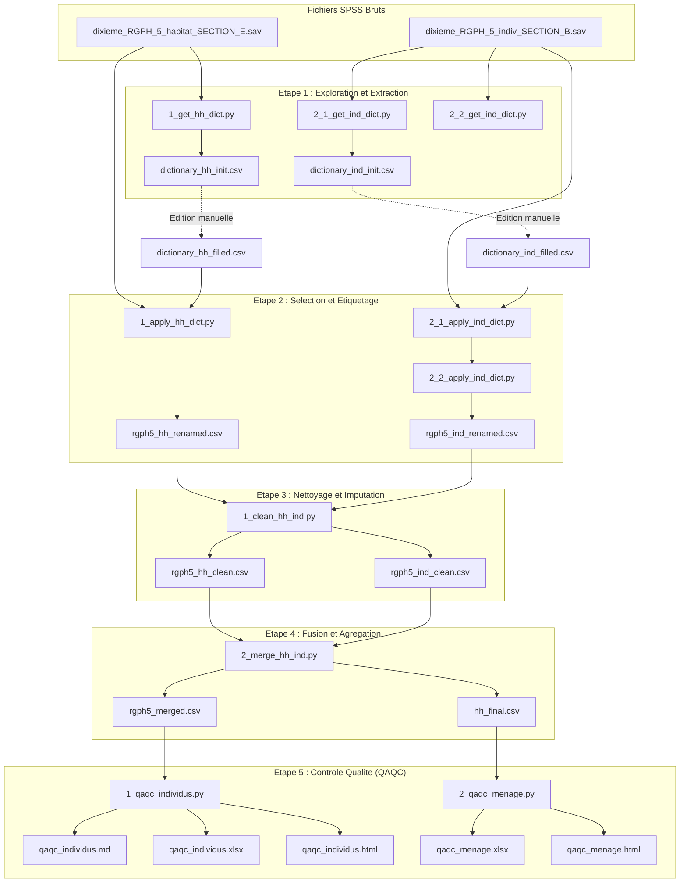

# Pipeline de Traitement et de Controle Qualite des Donnees RGPH-5

Ce projet implemente un pipeline complet en Python pour le traitement, le nettoyage, la fusion et l'evaluation de la qualite (QA/QC) des donnees issues du recensement general de la population et de l'habitat (RGPH-5). Il traite en particulier les questionnaires relatifs aux menages (habitat, Section E) et aux individus (Section B).

---

## Schema du Flux de Donnees

Le diagramme suivant illustre le flux de donnees à travers les differentes etapes du pipeline, de l'extraction initiale des dictionnaires jusqu'à la generation des rapports de controle qualite :



---

## Organisation et Etapes du Pipeline

L'ensemble des fichiers et des scripts est structure selon les etapes logiques d'execution :

### Etape 1 : Exploration et Extraction des Dictionnaires Initiaux
Ces scripts lisent les metadonnees des fichiers SPSS bruts (`.sav`) et generent des squelettes de dictionnaires au format CSV dans `data/aux_file/` :
- [1_get_hh_dict.py](cleansurvey/1_data_exploration/1_get_initial_dict/1_get_hh_dict.py) : Extraction du dictionnaire initial pour la table menages (`dictionary_hh_init.csv`).
- [2_1_get_ind_dict.py](cleansurvey/1_data_exploration/1_get_initial_dict/2_1_get_ind_dict.py) : Extraction du dictionnaire initial pour la table individus (Partie 1, `dictionary_ind_init.csv`).
- [2_2_get_ind_dict.py](cleansurvey/1_data_exploration/1_get_initial_dict/2_2_get_ind_dict.py) : Extraction du dictionnaire initial pour la table individus (Partie 2).

Pour specifier les variables a conserver ainsi que leurs nouveaux noms, les fichiers `*_init.csv` de `data/aux_file/` doivent etre copies sous le nom `*_filled.csv` et configures (definir la colonne `keep` a 'yes' et preciser `var_new` et `type_new`).

### Etape 2 : Selection, Typage et Etiquetage
Les scripts filtrent les variables en fonction des choix renseignes dans les dictionnaires `_filled.csv`, les renomment avec des identifiants lisibles et associent chaque code numerique de categorie a son etiquette textuelle correspondante :
- [1_apply_hh_dict.py](cleansurvey/1_data_exploration/2_select_and_label/1_apply_hh_dict.py) : Application du dictionnaire et des modalites pour les menages (`rgph5_hh_renamed.csv`).
- [2_1_apply_ind_dict.py](cleansurvey/1_data_exploration/2_select_and_label/2_1_apply_ind_dict.py) : Application du dictionnaire pour les individus (Selection et typage).
- [2_2_apply_ind_dict.py](cleansurvey/1_data_exploration/2_select_and_label/2_2_apply_ind_dict.py) : Application du dictionnaire de modalites pour les individus (`rgph5_ind_renamed.csv`).

### Etape 3 : Nettoyage Standardise et Imputation
Le script [1_clean_hh_ind.py](cleansurvey/2_clean_and_merge/1_clean_hh_ind.py) effectue les operations de qualite suivantes :
- Remplacement des codes speciaux representant des valeurs manquantes ou non-reponses (ex : 99.0, 999.0) par des valeurs `NaN` standardisees.
- Verification des limites admissibles pour les variables numeriques (ex : l'age doit etre compris entre 0 et 120 ans) definies dans [config.py](cleansurvey/config.py).
- Imputation des donnees manquantes selon les strategies definies par variable (mediane, moyenne, valeur zero ou le mode).
- Application des regles de validation croisee pour garantir la coherence logique (ex : correction de l'etat matrimonial des enfants de moins de 12 ans, verification de la coherence de genre pour le conjoint du chef de menage, annulation des revenus declareux pour les inactifs).
- Produits de sortie : `rgph5_hh_clean.csv` et `rgph5_ind_clean.csv` dans `data/`.

### Etape 4 : Calcul d'Agregats et Fusion des Bases
Le script [2_merge_hh_ind.py](cleansurvey/2_clean_and_merge/2_merge_hh_ind.py) :
- Calcule des variables de synthese au niveau du menage a partir des informations detaillees des individus (nombre d'enfants de moins de 5 ans, nombre de femmes en age de procrer entre 15 et 49 ans, ratio de dependance economique).
- Enregistrer la base finale des menages (`data/hh_final.csv`).
- Fusionne la base des individus nettoyes avec celle des menages via une jointure gauche basee sur l'identifiant composite de menage (`men_id`), en resolvant les eventuels conflits de colonnes dupliquees.
- Produit de sortie : `data/rgph5_merged.csv`.

### Etape 5 : Controle de Qualite (QA/QC) et Rapports
Les scripts generent des bilans d'assurance qualite au format Excel, HTML ou Markdown dans le repertoire `data/output_qaqc/` (comprenant des resumés statistiques généraux, l'analyse des valeurs manquantes, et le log complet des corrections logiques appliquees) :
- [1_qaqc_individus.py](cleansurvey/9_qaqc/1_qaqc_individus.py) : Rapport QAQC pour la table des individus (produit `data/output_qaqc/qaqc_individus.md`).
- [2_qaqc_menage.py](cleansurvey/9_qaqc/2_qaqc_menage.py) : Rapport QAQC pour la table des menages (produit `data/output_qaqc/qaqc_menage.xlsx` et `qaqc_menage.html`).

---

## Fichiers de Configuration et d'Execution

- [config.py](cleansurvey/config.py) : Fichier de configuration centralisant les chemins des repertoires, les parametres de nettoyage et les regles de coherence logique. Il permet de personnaliser :
  - Les dossiers d'entree et de sortie (`INPUT_DIR`, `OUTPUT_DIR`, `AUX_DIR`, `QAQC_DIR`).
  - Les bornes de validite numerique (`numeric_bounds`).
  - Les regles d'imputation (`numeric_impute` et `categ_impute`).
  - Les regles metiers de coherence inter-variables (`consistency_rules`).
  - La methode de resolution des colonnes homonymes issues de la jointure (`duplicate_cols_strategy`).
- [utils.py](cleansurvey/utils.py) : Fonctions utilitaires partagees pour le chargement des fichiers SAV (SPSS), l'application des dictionnaires de variables/modalites, le nettoyage et la generation de rapports.
- [run_all.py](cleansurvey/run_all.py) : Script principal d'execution permettant de lancer l'ensemble des etapes du pipeline dans l'ordre requis.

---

## Repertoires de Donnees et de Sortie (Dossier `data/`)

Les donnees brutes (fichiers `.sav` SPSS de depart) sont exclues de ce repertoire et pointees dans la configuration. Le dossier [data](data) sert de receptacle pour les resultats du traitement :
- [aux_file](data/aux_file) : Repertoire contenant les fichiers de dictionnaires de donnees CSV initiaux et remplis.
- [output_qaqc](data/output_qaqc) : Repertoire de sauvegarde des rapports de controle qualite Excel, HTML et Markdown.
- Les fichiers CSV intermediaires et finaux generes (`rgph5_hh_renamed.csv`, `rgph5_ind_renamed.csv`, `rgph5_hh_clean.csv`, `rgph5_ind_clean.csv`, `hh_final.csv` et `rgph5_merged.csv`) sont exclus du suivi Git pour des raisons de volume de donnees.

---

## Guide d'Installation et d'Execution

### Prérequis
- Python 3.x
- Les bibliotheques Python listees dans [requirements.txt](requirements.txt)

### Configuration de l'Environnement de Travail
Il est recommande d'utiliser un environnement virtuel Python pour isoler les dependances du projet :
```bash
python3 -m venv venv
source venv/bin/activate
pip install -r requirements.txt
```

### Execution
Pour executer l'ensemble du pipeline de traitement (nettoyage prealable des anciens fichiers, preparation, typage, imputation, fusion et rapports de controle) :
```bash
python3 cleansurvey/run_all.py
```

Chaque script peut egalement etre execute individuellement dans l'ordre chronologique des etapes pour tester ou valider un module specifique.
